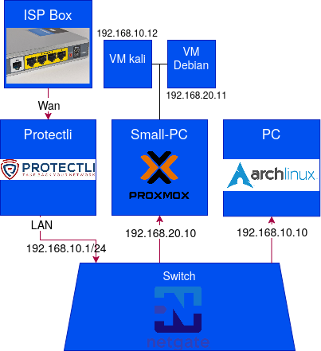

# 🕸️ Network Topology

This diagram represents the physical and logical architecture of the Homelab, featuring strictly segmented VLANs managed by the Protectli OPNsense firewall.

*Last updated: 2026-05-10*
